# GOATMessenger 📱

A simple **cross-platform messaging app** developed as part of the **Database Systems Course Project (May 2023)**.  
GOATMessenger enables users to communicate seamlessly through personal chats, groups, and broadcasts.

---

## 🚀 Features
- **User Authentication** – Secure registration and login via unique phone numbers.  
- **Personal Chats** – One-to-one private messaging.  
- **Group Chats** – Multi-user conversations with admin privileges.  
- **Broadcasts** – Send a single message to multiple users simultaneously.  
- **Message Management** – Send, receive, and delete messages.  
- **Settings** – Manage account details, chats, and group/broadcast preferences.  

---

## 🛠️ Tech Stack
- **Frontend & Mobile App:** Flutter (Dart)  
- **Backend:** PHP (REST API)  
- **Database:** MySQL  
- **Server:** Apache on Linux  

---

## 🗄️ Database Design
- **Entity Relationship Diagram (ERD):**  
  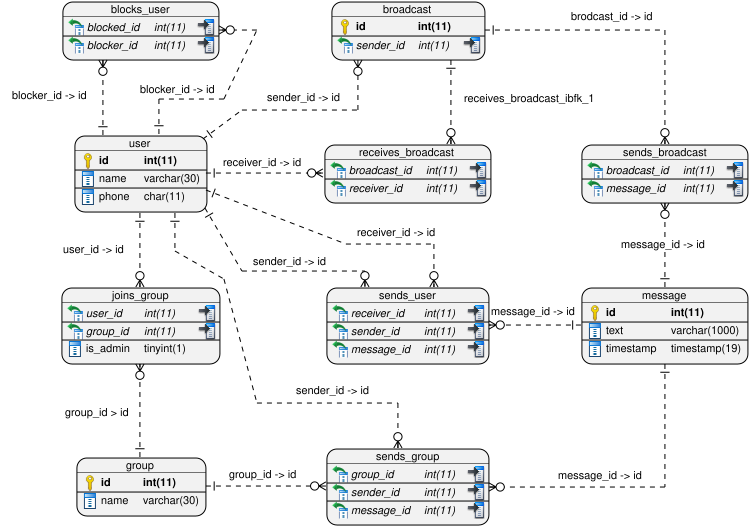  

---

## 📸 Screenshots

### 🔑 Login & Registration
<p align="center">
  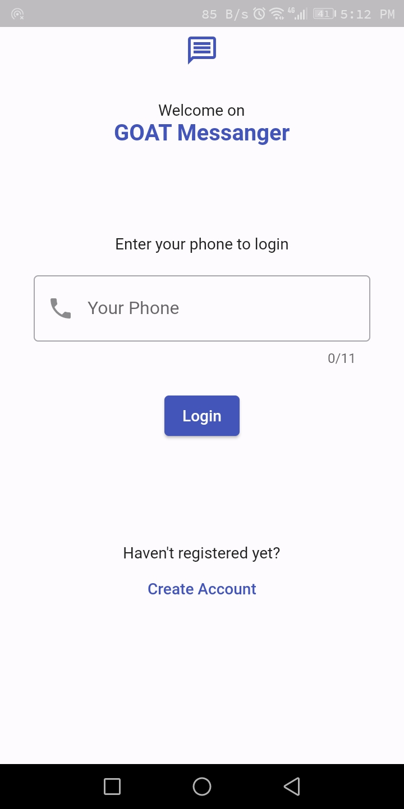
  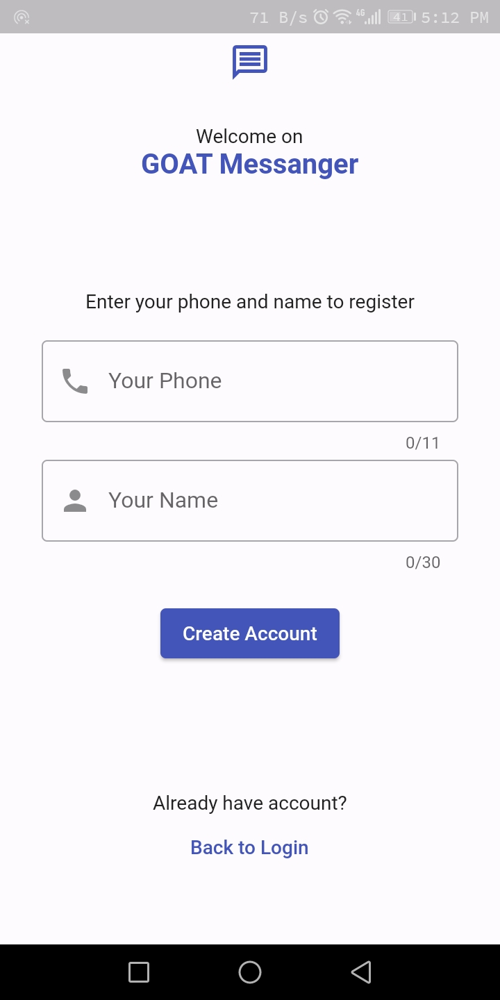
</p>

### 🏠 Home Page (Chats Overview)
<p align="center">
  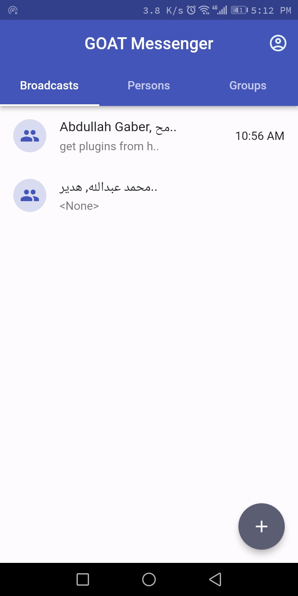
  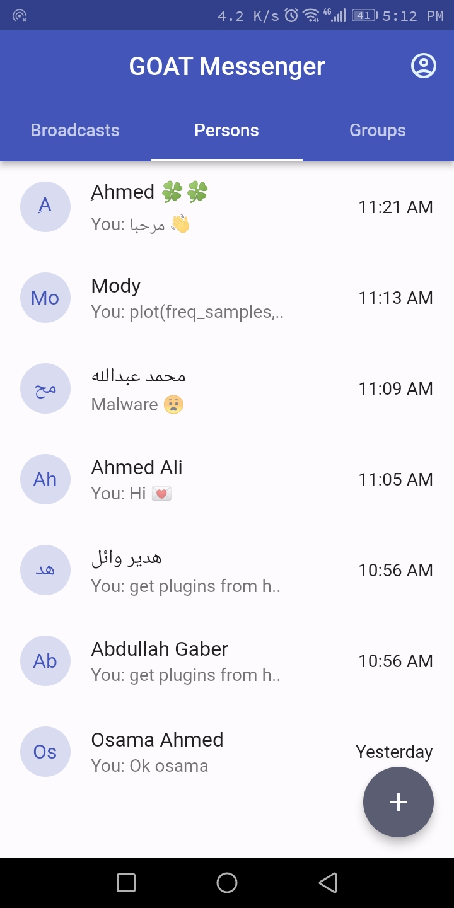
  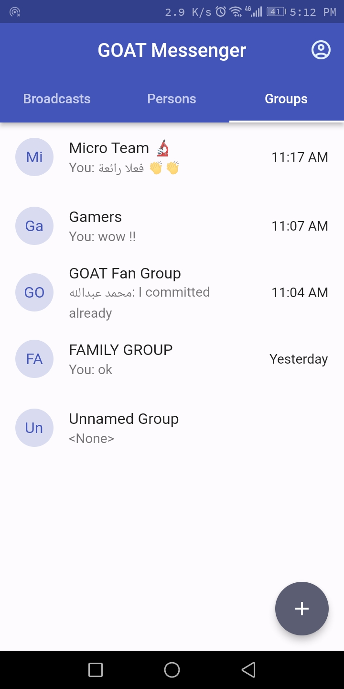
</p>

### 💬 Chat Pages
<p align="center">
  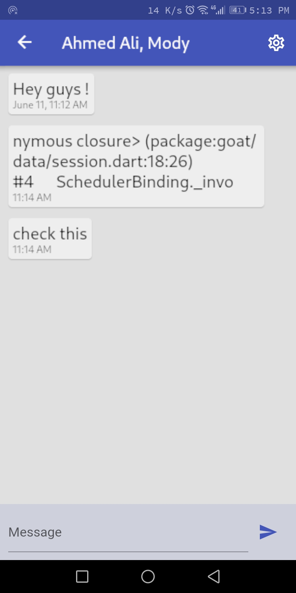
  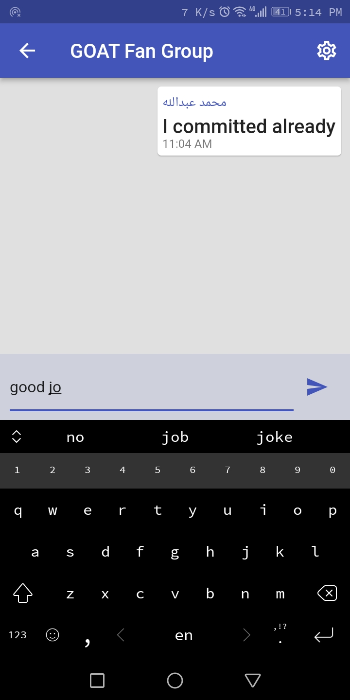
  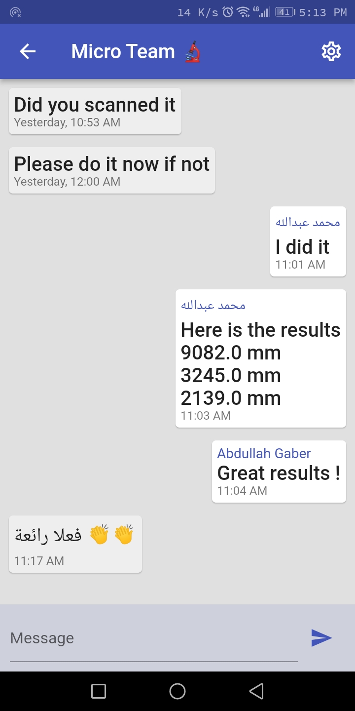
</p>

### ➕ Create Chats
<p align="center">
  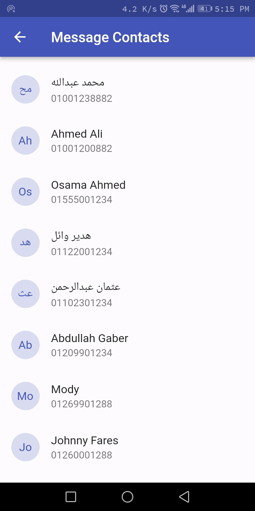
  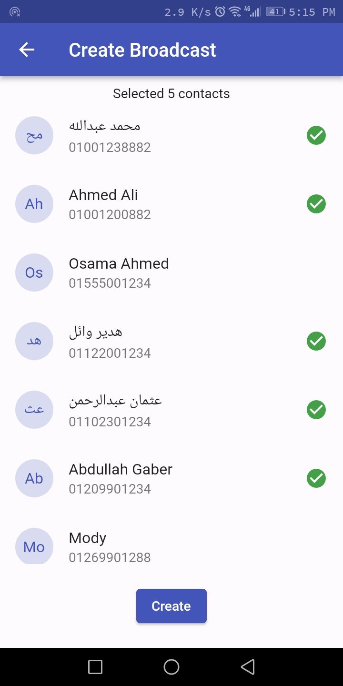
  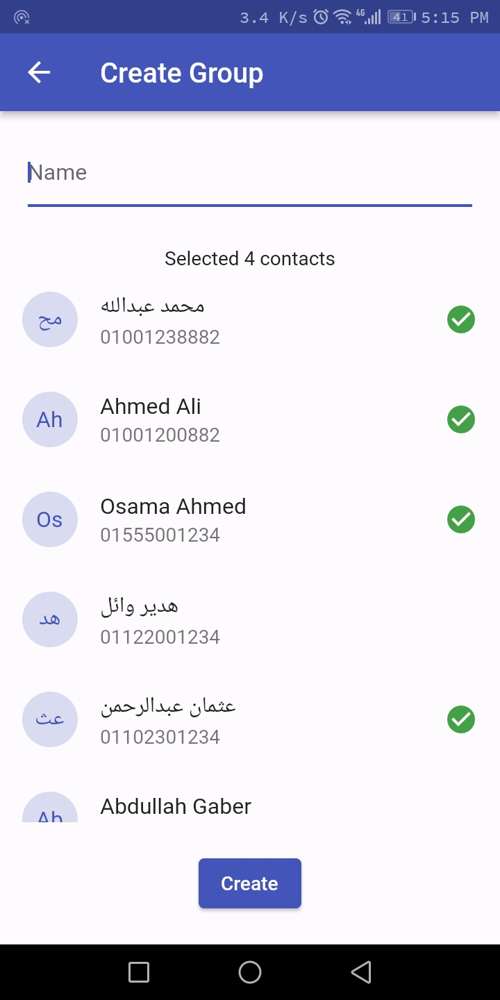
</p>

### ⚙️ Settings & Management
<p align="center">
  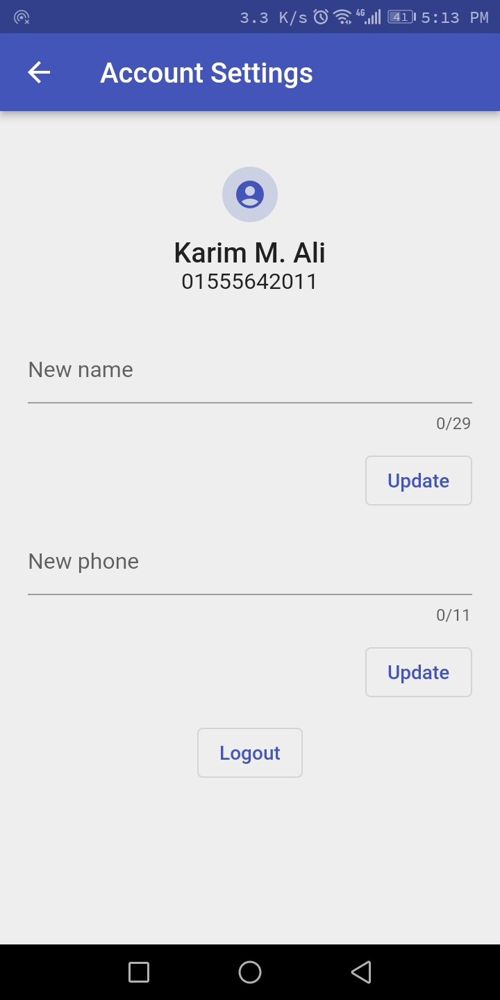
  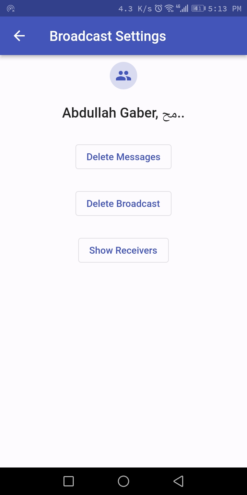
  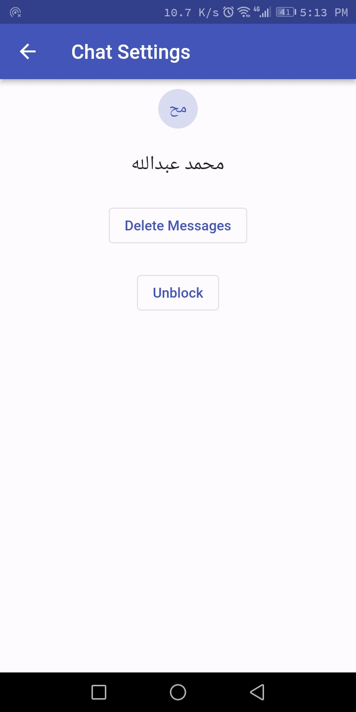
</p>

<p align="center">
  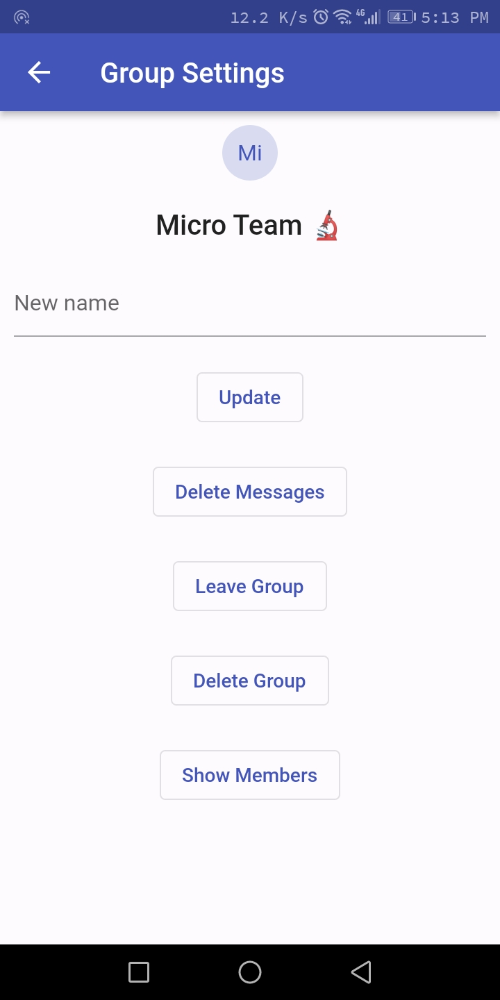
  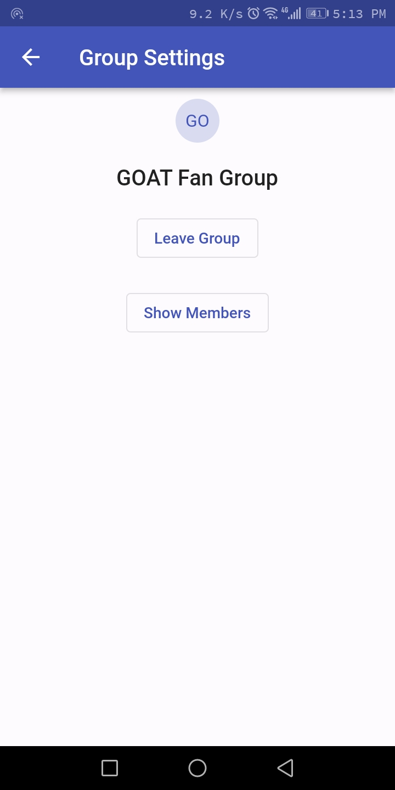
  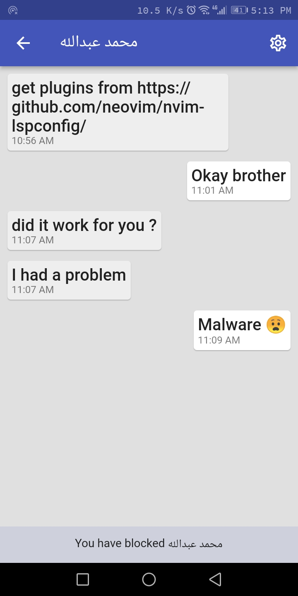
</p>


---

## 📂 Project Structure

The repository is organized as follows:

```
.
├── android/                  # Android-specific project files and build configs
├── docs/                     # Documentation assets (ERD, screenshots, etc.)
├── lib/                      # Flutter application source code
│   ├── data/                 # Data handling (API requests, sessions, etc.)
│   ├── pages/                # UI screens and app pages
│   ├── tools/                # Utility functions (formatting, helpers)
│   ├── widgets/              # Reusable UI components (dialogs, snackbars)
│   └── main.dart             # App entry point
├── linux/                    # Linux-specific project files
├── php/                      # Backend PHP API endpoint(s)
├── pubspec.yaml              # Flutter dependencies and configuration
├── analysis_options.yaml      # Linting and code style rules
└── README.md                 # Project documentation
```

### ▶️ How to Run
1. **Install dependencies**  
   ```bash
   flutter pub get
   ```
2. **Run the app (mobile or desktop)**  
   ```bash
   flutter run
   ```
3. **Backend setup**  
   - Deploy `php/index.php` to an Apache server with MySQL configured.  
   - Update API endpoint URLs in the Flutter app if needed.  
